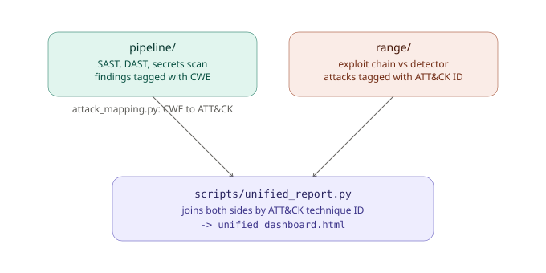

# Sentinel

Sentinel is a two-part AppSec lab I built to cover both sides of application security instead of
just one. Most portfolio projects are either a scanner (find bugs before release) or a SIEM-style
detector (catch attacks at runtime) — I wanted something that does both and actually connects them,
because that's closer to how a real purple-team workflow works: you find a vulnerability class
statically, and separately you need to know whether your detections would actually catch someone
exploiting that same class live.

There are two subprojects, plus a small script that ties their output together:

- **`pipeline/`** — a CI/CD-style AppSec pipeline. SAST + DAST + secrets scanning, a SQLite-backed
  triage workflow, dedup/auto-routing/SLA automation, and a terminal metrics dashboard. This is the
  "find it before it ships" half.
- **`range/`** — a small vulnerable Flask API, an automated exploit chain that attacks it, and a
  log-based detector that has to catch each attack in near real time. This is the "if it ships
  anyway, do we notice" half.
- **`scripts/unified_report.py`** — joins the two on MITRE ATT&CK technique ID. A finding from
  `pipeline` (e.g. `CWE-89` SQL injection) and a live detection from `range` (`T1190`) land on the
  same coverage row instead of two dashboards that never talk to each other.

Both halves were separate repos originally. `pipeline/scanner/attack_mapping.py` is the piece that
actually merges them — it maps every CWE the scanner can find to an ATT&CK technique ID, which is
what makes the unified report possible.

> **Lab project — don't deploy this anywhere real.** Both `pipeline/dast_target/` and
> `range/vulnerable_app/` are intentionally, deliberately insecure. That's the point. Keep it local.

## How it fits together



```
sentinel-platform/
├── pipeline/     scan -> triage -> dashboard -> automate. CLI: python3 sentinel.py
├── range/        vulnerable target -> exploit chain -> detector -> MTTD report
└── scripts/      unified_report.py joins both by ATT&CK technique ID
```

## Quick start

**pipeline** — scan, triage, dashboard, automate, all in one command:
```bash
cd pipeline
python3 -m venv venv && source venv/bin/activate   # PEP 668 environments (Ubuntu 23.04+/Debian 12+) need this
pip install -r requirements.txt
python3 sentinel.py demo
```

**range** — attack, detect, MTTD report, three terminals:
```bash
cd range
pip install -r requirements.txt

# terminal 1
python3 vulnerable_app/app.py            # runs on :5060

# terminal 2
python3 detector/detection_engine.py --follow

# terminal 3
python3 attacker/exploit_runner.py
python3 dashboard/report_generator.py && open dashboard/dashboard.html
```

You can run both at the same time — `range`'s target sits on `:5060` and `pipeline`'s bundled DAST
target sits on `:5050`, so they don't collide. That wasn't the case when these were two separate
repos and is one of the first things I had to fix when merging them.

Each subproject has its own README with the full command reference — `pipeline/README.md` covers
Docker/Kubernetes/CI, `range/README.md` covers the seeded vulnerabilities and detection rules in
detail.

**unified report** — joins both halves by ATT&CK technique ID:
```bash
python3 scripts/unified_report.py
open scripts/unified_dashboard.html
```
This reads open findings out of the pipeline's SQLite DB (it seeds itself with demo data on first
run) and matches them against the range's attack/detection logs by MITRE ATT&CK ID, so you get one
table per technique: caught pre-release? exploited and detected at runtime? both? If you haven't
run a live attack chain yet it falls back to the logs checked into `range/sample_run/`, so this
works even with zero setup.

## What's actually going on under the hood

`pipeline/scanner/engine.py` does the scanning — SAST is regex/AST-style pattern matching over the
target directory (SQL string concatenation, `eval`/`os.system` calls, weak hashes, hardcoded
secrets), DAST sends real HTTP requests at a running target (header checks, an XSS probe, an IDOR
comparison across a few IDs, open-redirect and cookie-flag checks), and the secrets scanner is
straightforward regex over common credential patterns (AWS keys, generic API tokens, etc). Every
finding gets a CWE ID, and `attack_mapping.py` looks that CWE up in a small hand-maintained table
to attach an ATT&CK technique ID where one clearly applies — it deliberately returns nothing for
CWEs that don't have a solid mapping rather than guessing.

Findings land in a SQLite DB (`aggregator/db.py`), and `automation/pipeline.py` runs three passes
over them: dedup near-identical findings, auto-route by file path to a team (`devops-team`,
`security-team`, etc.), and flag anything past its SLA window. `dashboard/metrics.py` turns all of
that into the terminal tables you see from `sentinel.py dashboard` — severity counts, MTTR vs SLA
target, scan history, pipeline health.

`range/` is simpler: `vulnerable_app/app.py` is a small Flask API with three real bugs seeded on
purpose (string-built SQL query, an endpoint that returns any user's profile with no ownership
check, and a JWT check that accepts `alg=none`). `attacker/exploit_runner.py` walks through
recon, then exercises all three. `detector/detection_engine.py` tails the app's access log and
runs independent detection logic for each — a SQLi signature match, a sliding window that flags
an IP touching 3+ distinct user IDs in 5 seconds, and a JWT header decode that flags unsigned
tokens. Recon traffic on its own isn't detected, on purpose — plain GETs to public endpoints are
indistinguishable from normal traffic, and I'd rather the dashboard show a real 75% detection rate
than fudge a rule just to hit 100%.

## Limitations, as of right now

- Detection in `range` is regex/heuristic, not a real SIEM. Wiring the same logs into
  Elastic/Wazuh is the obvious next step if this needs to look more production-grade.
- `pipeline`'s Dockerfile and Kubernetes manifests follow standard patterns but I haven't run them
  against a live Docker daemon or a real cluster yet — worth testing before trusting them.
- The CWE → ATT&CK table is intentionally small. Extending `range` with a 4th vulnerability class
  (SSRF or path traversal, most likely) would let it overlap more of what the pipeline already
  flags statically.

## Design docs

Wrote these up separately since they got long enough to not belong in this file:

- [`docs/design/HLD.md`](docs/design/HLD.md) — high-level design
- [`docs/design/LLD.md`](docs/design/LLD.md) — low-level design
- [`docs/design/sequence-diagrams.md`](docs/design/sequence-diagrams.md) — sequence diagrams
- [`docs/design/data-flow.md`](docs/design/data-flow.md) — data flow
